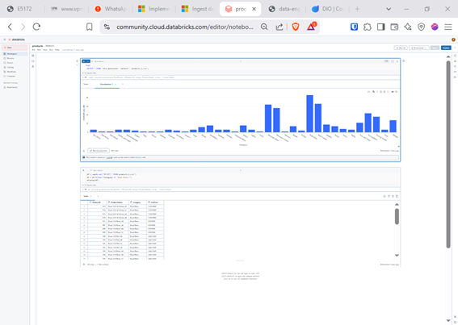
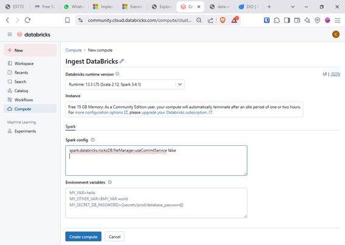
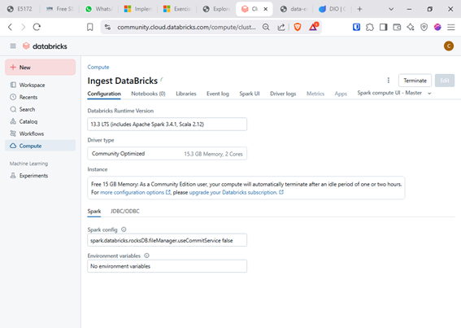
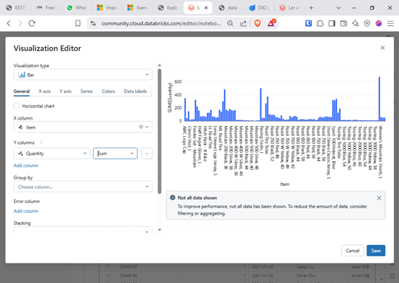
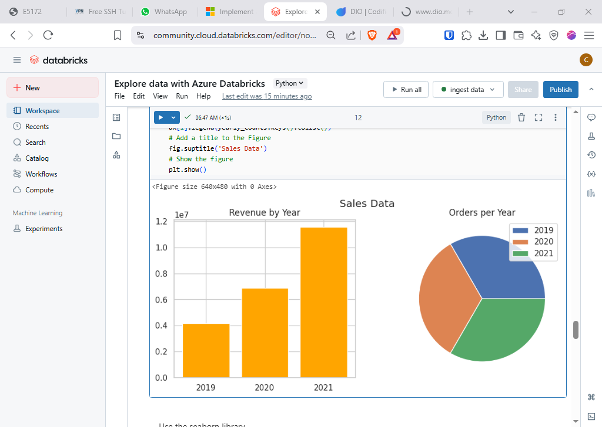
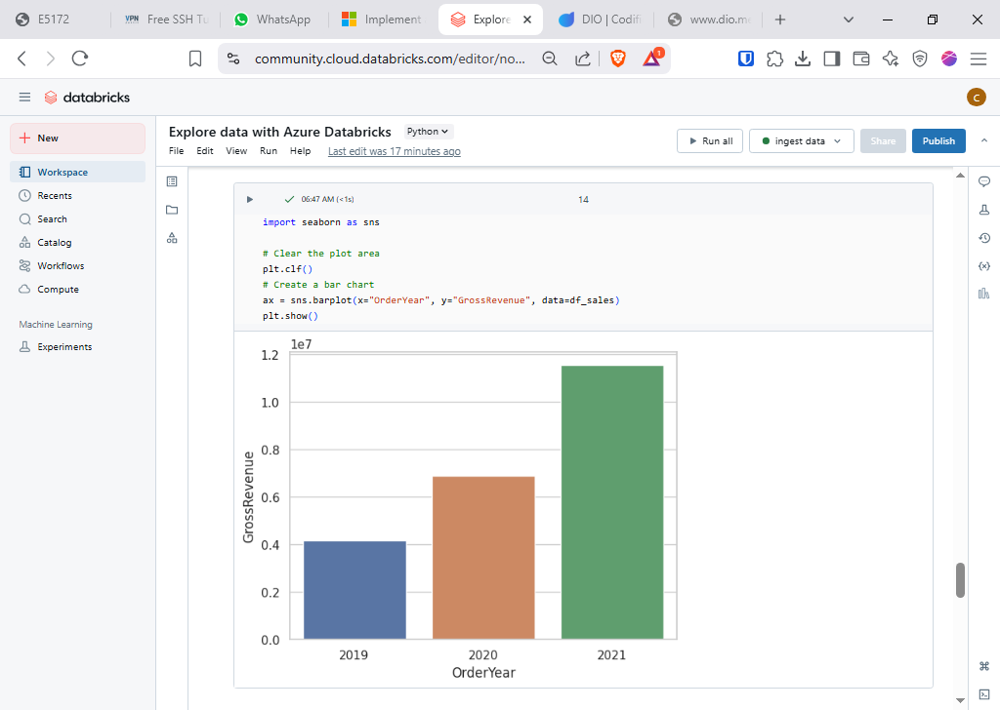

# DIO-adb notebook exercise
Exercise of DIO Azure DataBricks course

# Introdução
No Microsoft Learn existe vários exercícios, como por exemplo o "Exlpore Azure DataBricks", 
como a imagem abaixo:

Nesse exercício foi carregado um ficheiro "producs.csv" para o catalog, e no notebook em uma das células fizemos 
uma consulta SQL, e criamos uma visualização com o resultado.  
Na outra célula foi carregado um dataframe, e executada uma operação de filtro.   
  
Agora iremos fazer o Exercício: https://microsoftlearning.github.io/mslearn-databricks/Instructions/Exercises/LA-02-Explore-data.html  

#  Criando o Cluster

No DataBricks community é mais simplificado as opções disponíveis para criar um Cluster, basicamente nome, versão, e podendo adicionar algumas configurações adicionais do spark.  
Mas, no Azure DataBricks temos mais opções relevantes a preencher, como por exemplos:  

Policy: Unrestricted
Cluster mode: Single Node
Access mode: Single user (with your user account selected)
Use Photon Acceleration: Selected
Node type: Standard_D4ds_v5
Terminate after 20 minutes of inactivity

Estas opções definirão o comportamento do cluster, como opção "Single Node" útil para pequenos projetos, e cluster de desenvolvimento pois todo spark rodara em apenas um nó tendo um desempenho baixo para volumes grande ou análise complexas.  
Também a última das opções define um tempo de desligamento a pois inatividade do cluster, evitando custo com o cluster ativo sem uso.  

Depois, do cluster criado podemos rever e alterar, algumas definições.  

#  Importando os ficheiros

existem diversas formas de importar ficheiro csv, neste exercício temos três url de ficheiro url:  
O primeiro foi importado pelo Pandas e depois convertido em dataframe do spark,
os outros via spark, mas com sintaxe ligeiramente diferente. Poder-se-ia simplificar fazendo a importação dos ficheiro em lotes, otimizando o processo com menos código e o processo ágil e de mais fácil manutenção, detalhes que se devem ter em conta, mais para fins educacionais foi explorada algumas da diversas formas de o fazer...

# Analizando o exercicio

Após a importação dos dados, para criar consultas SQL, poderiamos carregar os dados diretamente via catalog, mas a opção utilizada foi carregar diretamente em dataframe, logo é

apois uma consuta SQL podemos criar uma visualização pela UI,  

Para usar o matplotlib, é necessário converter o nosso dataframe para um Pandas dataframe:
df_sales = df_spark.toPandas()
Com matplotlib é possível criar vários de gráficos, pois é uma biblioteca python para criação de visualizações para dados estatísticos.

A seaborn, também biblioteca python, também permite criar gráficos do matplotlib, mas oferece uma abstrai alguma complexidade na criação dos mesmos gráficos.

O exercicio analisa a faturação nos anos 2019 a 2021, Veja o notebook completo: [Exercício Completo](notebooks/Explore%20data%20with%20Azure%20Databricks.ipynb)

